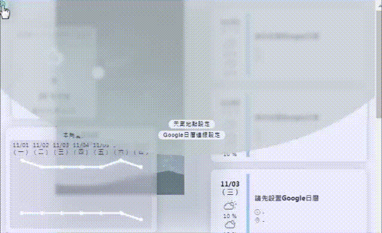
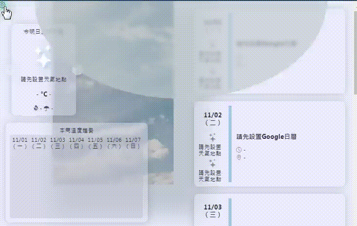
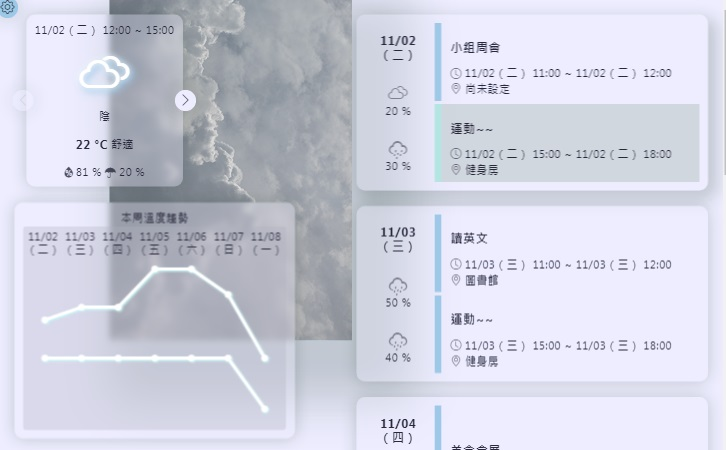
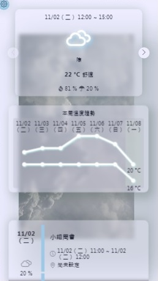

# Schedule-with-weather

## A web app allows you to arrange your weekly events based on weather forecast.
&#128204; [live demo link](https://ellie-yen.github.io/schedule-with-weather/)

* description:  
This website combined the weather api (3-day/ week forecast) and google calendar api together. 
You could provide Google API key and Google Calendar ID to fetch your data, and the website **will not remember/ use all these data**.
You can toggle on *使用展示範例* in calendar source setting to preview the example if you don't have Google API key or don't want to use it.

* techs:
 * Self-created components (by [styled-component](https://styled-components.com/)) to create united and responsive visual layout.
 * Delicate customized select / input elements with hint when being invalid, which is controlled by *useEffect*, *useRef*, *useEffect*.
 * With mechanism similar to MVC(model-view-controller), the content of each section will change as the fetching state - including loading, fetch failed, fetch successfully.

* source and liscense:
  * This project was bootstrapped with [Create React App](https://github.com/facebook/create-react-app).
  * [styled-component](https://styled-components.com/)
  * Weather data provider: [台灣政府資料開放平台-中央氣象局](https://opendata.cwb.gov.tw)
  * Source and license of Weather icon: [erikflowers](https://erikflowers.github.io/weather-icons/).
  * Source and license of other icon: [Bootstrap](https://getbootstrap.com/).
  * Source and license of pictures: [pexels](https://www.pexels.com/).

